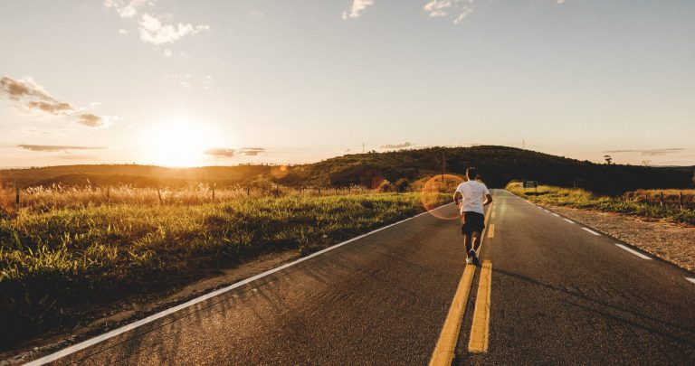

# Kommer vi videre?

**2019-06-10 | Sondre Bjellås**

Nå har det vært over to år siden sist innlegg her på siden, og har vi kommet noe videre med mer frihet? Føler du at du har opplevd mer frihet i ditt liv, eller har det utviklet seg i motsatt retning?

Det er flere årsaker til at jeg ikke har skrevet på en stund, den viktigste er tekniske utfordringer. Vært mye å gjøre de siste årene, så ikke fått gjort alt som skal ordnes for å få bloggen tilbake. Nå er jeg tilbake, og håper det kommer hyppige innlegg fremover.

Selv har jeg brukt mye tid de siste årene på utviklingen av Liberstad, prosjektet for å etablere norske første private by.

Mye tid har også gått med på utvikling av City Chain, som er et nytt blokkjede som er etablert for å være fundamentet for Smart City Platform, som er en plattform vi utvikler for å kunne levere by-tjenester på en moderne plattform, som gir økt fleksiblitet og reduserte kostnader på de tjenestene som Liberstad vil levere internt i byen, til besøkende og beboere.

Hva har du gjort i det siste for å øke friheten i ditt liv? Del gjerne dine erfaringer i en kommentar nedenfor.

Hvis du er ny på siden, så velkommen til utenstat, en sted hvor vi undersøker den teoretiske og pratiske muligheten for å bygget et samfunn basert utelukkende på frivillige handlinger mellom individer.

Til neste gang, takk for alt!

Foto av Jonathan Borba on Unsplash